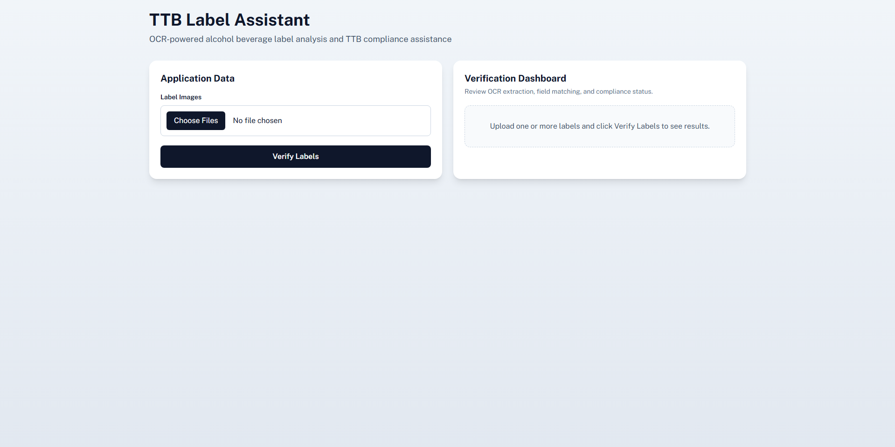
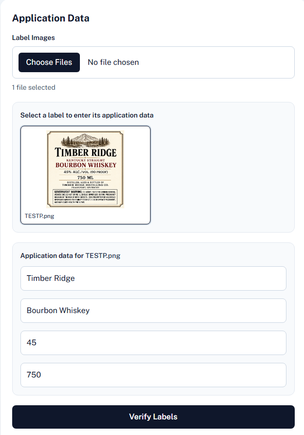
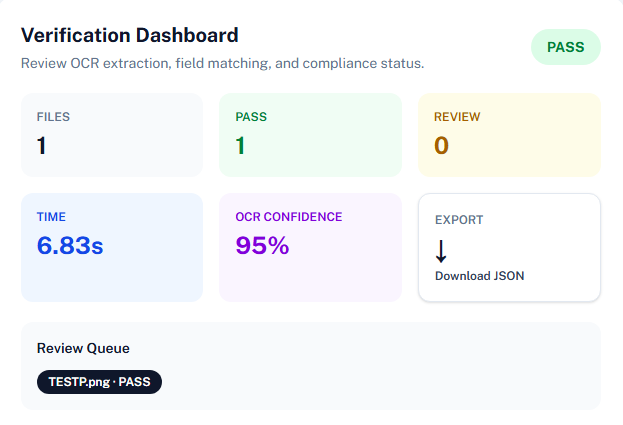
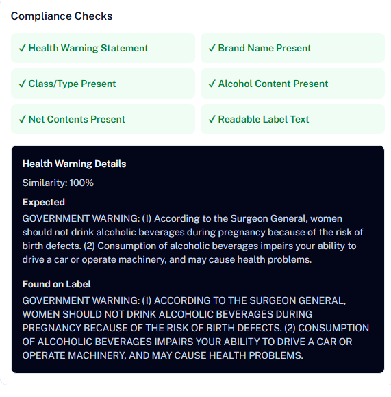
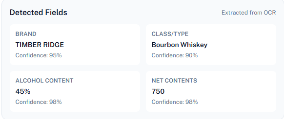
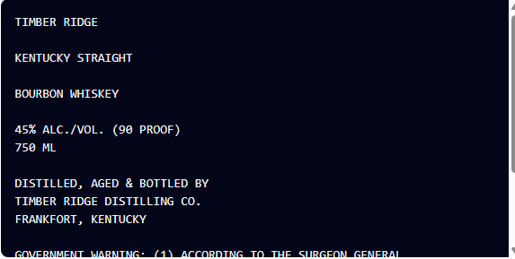
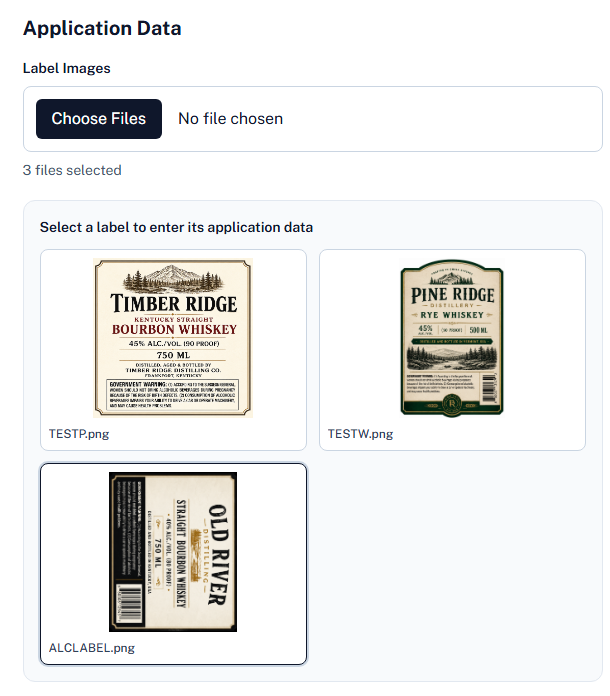
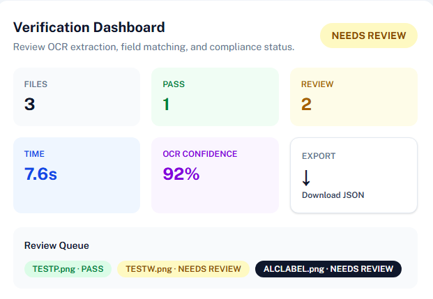

# TTB Label Assistant

## Overview

TTB Label Assistant is an AI-assisted prototype designed to streamline alcohol beverage label reviews. The application uses Optical Character Recognition (OCR) and rule-based validation to automatically extract label information, compare it against application data, and identify potential compliance issues requiring human review.

The project was developed as a proof-of-concept to reduce the manual effort associated with routine label verification tasks while maintaining a human-in-the-loop review process.

---

## Problem Statement

Alcohol label reviewers spend significant time manually verifying information between submitted applications and label artwork. Many reviews involve repetitive comparisons such as:

* Brand Name
* Class/Type Designation
* Alcohol Content
* Net Contents
* Government Health Warning

This application automates those routine checks and highlights discrepancies for further review.

---

## Features

### OCR Extraction

* Extracts text from uploaded alcohol label images using Tesseract OCR.
* Supports multiple image uploads.
* Handles rotated labels through automatic orientation correction.
* Provides OCR confidence scoring.

### Field Extraction

Automatically identifies:

* Brand Name
* Class/Type Designation
* Alcohol Content (ABV)
* Net Contents
* Government Warning Statement

### Verification Engine

Compares extracted values against user-provided application data and generates:

* Match
* Needs Review

results for each field.

### Compliance Validation

Validates the presence of required label elements including:

* Brand Name
* Class/Type
* Alcohol Content
* Net Contents
* Government Health Warning

### Review Dashboard

Provides:

* OCR confidence metrics
* Compliance check summaries
* Field-by-field verification results
* Review explanations for failed checks
* Raw OCR values for manual verification

### Export

* JSON export of verification results.

---

## Tech Stack

### Frontend

* Next.js
* React
* TypeScript
* Tailwind CSS

### Backend

* FastAPI
* Python
* Tesseract OCR
* Pillow
* RapidFuzz

---

## System Architecture

```text
User Upload
      │
      ▼
Next.js Frontend
      │
      ▼
FastAPI Backend
      │
      ▼
OCR Processing
(Tesseract)
      │
      ▼
Field Extraction
      │
      ▼
Verification Engine
      │
      ▼
Compliance Validation
      │
      ▼
Review Dashboard
```

---

## Installation

### Backend

```bash
cd backend

python -m venv venv

venv\Scripts\activate

pip install -r requirements.txt

python -m uvicorn main:app --reload
```

### Additional Dependency

This project requires Tesseract OCR to be installed separately.

Download:
https://github.com/tesseract-ocr/tesseract

After installation, ensure the Tesseract executable is available in your system PATH.

### Frontend

```bash
cd frontend

npm install

npm run dev
```

---

## Usage

1. Upload one or more alcohol label images.
2. Enter application data for each label.
3. Select **Verify Labels**.
4. Review extracted OCR fields.
5. Review compliance validation results.
6. Export results as JSON if desired.

---

## Compliance Checks

The prototype currently validates:

* Brand Name Match
* Class/Type Match
* Alcohol Content Match
* Net Contents Match
* Government Warning Presence
* Health Warning Similarity
* OCR Readability

Labels that fail validation thresholds are flagged as **Needs Review**.

---

## Government Warning Validation

The application validates the standard U.S. Government Health Warning Statement required under 27 CFR Part 16.

The warning text is extracted using OCR and compared against the required statement using similarity matching. Labels that do not meet the configured similarity threshold are flagged for manual review.

The system also verifies the presence of the required **"GOVERNMENT WARNING:"** header before performing statement validation.

Current implementation validates the standard federal warning statement:

> GOVERNMENT WARNING: (1) According to the Surgeon General, women should not drink alcoholic beverages during pregnancy because of the risk of birth defects. (2) Consumption of alcoholic beverages impairs your ability to drive a car or operate machinery, and may cause health problems.

This validation is intended to assist reviewers and does not replace official TTB compliance review procedures.


## Design Decisions

### Tesseract OCR

Tesseract was selected because:

* Runs locally without cloud dependencies.
* Works in restricted network environments.
* Requires no external API keys.
* Supports offline processing.

### Human-in-the-Loop Review

The application does not automatically approve labels. Instead, it highlights discrepancies and provides review explanations so compliance agents can make final decisions.

### Performance

The system was designed to return results within a few seconds for typical label images while supporting batch uploads.

---

## Additional Documentation

For a detailed explanation of architectural decisions, OCR strategy, compliance validation logic, tradeoffs, and future improvements, see:

- [APPROACH.md](APPROACH.md)

## Assumptions

* Labels are primarily English-language labels.
* Images are reasonably readable and not heavily obstructed.
* OCR accuracy depends on image quality, lighting, and typography.
* This prototype assists reviewers and is not intended to replace official TTB review procedures.

---

## Limitations

* Decorative fonts may reduce OCR accuracy.
* Poor image quality can impact extraction results.
* The prototype does not integrate directly with COLA.
* The application performs rule-based validation rather than full regulatory review.
* Some TTB requirements are simplified for prototype purposes.

---

## Future Improvements

* PaddleOCR integration
* CSV and PDF exports
* Database persistence
* User authentication
* Audit trail history
* Additional TTB compliance checks
* Automated image enhancement
* AI-assisted field extraction and classification

---

## Screenshots

### Dashboard Overview





### Compliance Review



### OCR Extraction




### Batch Overview




---

## Demo Video
Watch the demo here:

[](https://youtu.be/MSSh_qRdyew)

## Author

Loc Huynh

GitHub: https://github.com/huynhloc03
